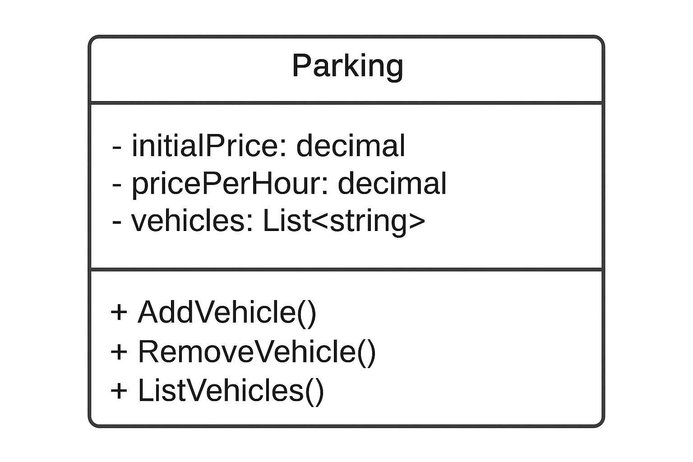

# DIO - .NET - Fundamentals [EN-US]

www.dio.me

## Project Challenge

For this challenge, you will need to use the knowledge you acquired in the fundamentals module of the DIO .NET track.

## Context

You have been hired to build a system for a parking lot, which will be used to manage parked vehicles and perform its operations, such as adding a vehicle, removing a vehicle (and displaying the amount charged for the period), and listing the vehicles.

## Proposal

You will need to build a class named "Estacionamento" (Parking Lot), according to the diagram below:

The class contains three variables:

**initialPrice**: Decimal type. It is the price charged to park your vehicle.

**pricePerHour**: Decimal type. It is the price per hour that the vehicle remains parked.

**vehicles**: A list of strings, representing a collection of parked vehicles. It contains only the vehicle's license plate.

The class contains three methods:

**AddVehicle**: Method responsible for receiving a license plate entered by the user and storing it in the **vehicles** variable.

**RemoveVehicle**: Method responsible for checking if a specific vehicle is parked, and if so, it will ask for the number of hours it remained in the parking lot. After that, it performs the following calculation: **initialPrice** \* **pricePerHour**, and displays it to the user.

**ListVehicles**: Lists all vehicles currently in the parking lot. If there are none, it displays the message "There are no parked vehicles.".

Finally, an interactive menu must be created with the following actions implemented:

1.  Register vehicle
2.  Remove vehicle
3.  List vehicles
4.  Exit

## Solution

The code is halfway done, and you must continue it by following the rules described above, so that in the end, we have a functional program. Look for the commented word "TODO" in the code, then implement it according to the rules above.

# DIO - Trilha .NET - Fundamentos [PT-BR]
www.dio.me

## Desafio de projeto
Para este desafio, você precisará usar seus conhecimentos adquiridos no módulo de fundamentos, da trilha .NET da DIO.

## Contexto
Você foi contratado para construir um sistema para um estacionamento, que será usado para gerenciar os veículos estacionados e realizar suas operações, como por exemplo adicionar um veículo, remover um veículo (e exibir o valor cobrado durante o período) e listar os veículos.

## Proposta
Você precisará construir uma classe chamada "Estacionamento", conforme o diagrama abaixo:

A classe contém três variáveis, sendo:

**initialPrice**: Tipo decimal. É o preço cobrado para deixar seu veículo estacionado.

**pricePerHour**: Tipo decimal. É o preço por hora que o veículo permanecer estacionado.

**vehicles**: É uma lista de string, representando uma coleção de veículos estacionados. Contém apenas a placa do veículo.

A classe contém três métodos, sendo:

**AddVehicle**: Método responsável por receber uma placa digitada pelo usuário e guardar na variável **vehicles**.

**RemoveVehicle**: Método responsável por verificar se um determinado veículo está estacionado, e caso positivo, irá pedir a quantidade de horas que ele permaneceu no estacionamento. Após isso, realiza o seguinte cálculo: **initialPrice** * **pricePerHour**, exibindo para o usuário.

**ListVehicles**: Lista todos os veículos presentes atualmente no estacionamento. Caso não haja nenhum, exibir a mensagem "Não há veículos estacionados".

Por último, deverá ser feito um menu interativo com as seguintes ações implementadas:
1. Cadastrar veículo
2. Remover veículo
3. Listar veículos
4. Encerrar

## Solução
O código está pela metade, e você deverá dar continuidade obedecendo as regras descritas acima, para que no final, tenhamos um programa funcional. Procure pela palavra comentada "TODO" no código, em seguida, implemente conforme as regras acima.
